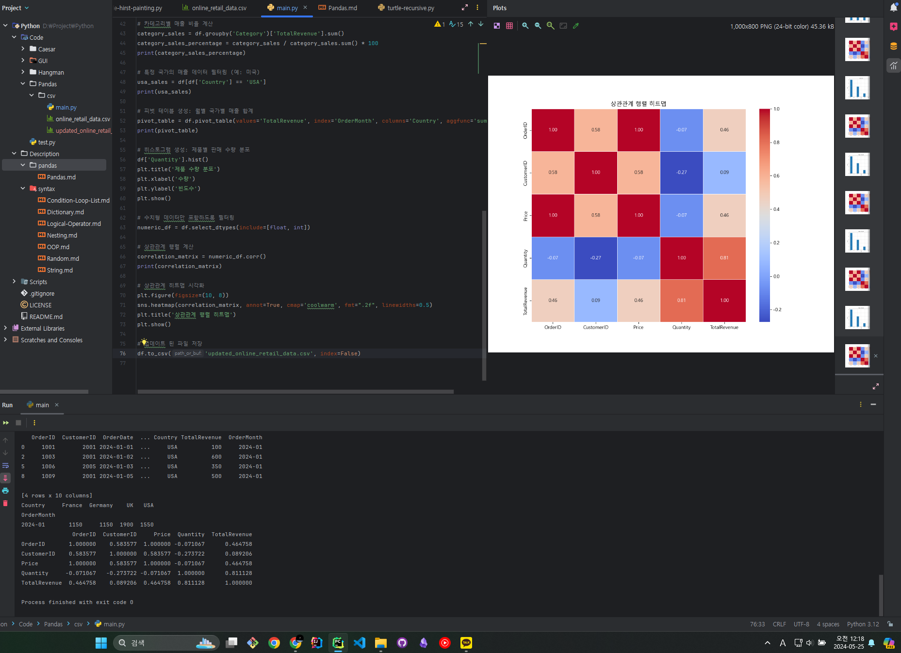

## Pandas

Pandas는 파이썬에서 데이터 조작과 분석을 위한 고성능 라이브러리입니다. 

주로 구조화된 데이터, 특히 표 형식의 데이터를 다루는 데 사용됩니다. 

Pandas는 데이터를 효율적으로 로드, 조작, 분석, 그리고 시각화할 수 있는 다양한 기능을 제공합니다.

<br>

### 주요 기능

> **데이터 구조**

- Series: 1차원 배열 형태의 데이터 구조로, 인덱스를 가진다.
- DataFrame: 2차원 표 형태의 데이터 구조로, 여러 열을 포함하며 각 열은 Series 객체로 구성된다.

<br>

> **데이터 입출력**

- CSV, Excel, SQL, JSON 등 다양한 파일 형식에서 데이터를 읽고 쓸 수 있다.

<br>

> **데이터 정제 및 조작**

- 결측치 처리: fillna(), dropna()
- 데이터 필터링: 조건에 맞는 데이터 선택
- 데이터 정렬: sort_values()
- 데이터 병합: merge(), concat()
- 그룹화 및 집계: groupby(), pivot_table()

<br>

> **시간 시리즈 데이터 처리**

- 날짜 및 시간 데이터를 파싱하고 조작할 수 있는 기능 제공.
- 통계 및 시각화
- 기본적인 통계 요약 및 matplotlib과 같은 시각화 도구와의 통합.

---

## Numpy
NumPy는 Pandas의 기반이 되는 라이브러리로, 주로 수치 및 선형 대수 연산을 위한 다차원 배열 객체(ndarray)를 제공합니다. 

<br>

### Pandas와의 차이점

> **데이터 구조**

- NumPy: 주로 다차원 배열(ndarray)을 제공하며, 동일한 데이터 타입을 가진 요소들로 구성된다.
- Pandas: Series와 DataFrame을 제공하며, 각 열이 다른 데이터 타입을 가질 수 있다.

<br>

> **데이터 처리 범위**

- NumPy: 수치 데이터의 대규모 연산 및 처리를 위한 고속 계산에 최적화되어 있다.
- Pandas: 표 형식 데이터의 조작과 분석에 중점을 두며, 데이터 클리닝, 변환, 분석 등에 주로 사용된다.

<br>

> **편의성**

- NumPy: 기본적인 배열 연산과 고급 수치 계산에 최적화된 함수 제공.
- Pandas: 데이터프레임 조작을 위한 고수준의 함수와 메서드를 제공하여 사용하기 쉽다.

<br>

> **기능성**

- NumPy: 배열 연산, 선형 대수, 난수 생성, 푸리에 변환 등 수치 연산 중심.
- Pandas: 데이터 로드, 필터링, 그룹화, 집계, 시각화 등 데이터 분석 중심.

---

## Pandas 예제

**데이터셋 (CSV)**

```csv
OrderID,CustomerID,OrderDate,Product,Category,Price,Quantity,Country
1001,2001,2024-01-01,Product A,Electronics,100,1,USA
1002,2002,2024-01-01,Product B,Electronics,150,2,UK
1003,2001,2024-01-02,Product C,Clothing,200,3,USA
1004,2003,2024-01-02,Product D,Clothing,250,1,France
1005,2004,2024-01-03,Product E,Furniture,300,2,Germany
1006,2005,2024-01-03,Product F,Furniture,350,1,USA
1007,2002,2024-01-04,Product G,Toys,400,4,UK
1008,2006,2024-01-04,Product H,Toys,450,2,France
1009,2001,2024-01-05,Product I,Electronics,500,1,USA
1010,2007,2024-01-05,Product J,Clothing,550,1,Germany
```

<br>

**코드**

- Pandas로 CSV를 읽어 컬럼들을 이용해 매출, 그룹별 매출, 국가 필터링, 피벗 테이블 생성
- Pandas의 hist()함수, metaplotlib을 이용한 데이터 시각화
- seaborn의 heatmap() 함수를 이용한 Pandas 데이터 프레임들의 상관관계 행렬 시각화
- seaborn의 displot(), pairplot()을 이용한 분포도/관계도 시각화

Pandas와 시각화 라이브러리들을 이용해 데이터 분석에 원하는 차트, 표등을 만들 수 있습니다.

```python
import pandas as pd
import matplotlib.pyplot as plt
import seaborn as sns

# CSV 파일을 읽어오기
df = pd.read_csv('online_retail_data.csv')

# 데이터 프레임의 상위 5개 행 출력
print(df.head())

# 데이터 프레임의 기본 정보 출력 (열 이름, 데이터 타입, null 값 등)
print(df.info())

# 기술 통계 요약 (수치형 데이터에 대해 count, mean, std, min, max 등)
print(df.describe())

# 새로운 열 추가: 총 매출 (가격 * 수량)
df['TotalRevenue'] = df['Price'] * df['Quantity']
print(df.head())

# 날짜 형식 변환 및 새로운 열 추가: 월별 매출 분석을 위해 'OrderMonth' 열 추가
df['OrderDate'] = pd.to_datetime(df['OrderDate'])
df['OrderMonth'] = df['OrderDate'].dt.to_period('M')
print(df.head())

# 월별 총 매출 계산
monthly_sales = df.groupby('OrderMonth')['TotalRevenue'].sum()
print(monthly_sales)

# 국가별 총 매출 계산
country_sales = df.groupby('Country')['TotalRevenue'].sum()
print(country_sales)

# 카테고리별 매출 비율 계산
category_sales = df.groupby('Category')['TotalRevenue'].sum()
category_sales_percentage = category_sales / category_sales.sum() * 100
print(category_sales_percentage)

# 특정 국가의 매출 데이터 필터링 (예: 미국)
usa_sales = df[df['Country'] == 'USA']
print(usa_sales)

# 피벗 테이블 생성: 월별 국가별 매출 합계
pivot_table = df.pivot_table(values='TotalRevenue', index='OrderMonth', columns='Country', aggfunc='sum')
print(pivot_table)

# 히스토그램 생성: 제품별 판매 수량 분포
df['Quantity'].hist()
plt.title('제품 수량 분포')
plt.xlabel('수량')
plt.ylabel('빈도수')
plt.show()

# 수치형 데이터만 포함하도록 필터링
numeric_df = df.select_dtypes(include=[float, int])

# 상관관계 행렬 계산
correlation_matrix = numeric_df.corr()
print(correlation_matrix)

# 상관관계 히트맵 시각화
plt.figure(figsize=(10, 8))
sns.heatmap(correlation_matrix, annot=True, cmap='coolwarm', fmt=".2f", linewidths=0.5)
plt.title('상관관계 행렬 히트맵')
plt.show()

# 업데이트 된 파일 저장
df.to_csv('updated_online_retail_data.csv', index=False)
```

<br>

실행 해보면 Pandas로 분석한 데이터를 seaborn과 metaplotlib을 이용해 시각화하여,

분석하기 좋은 히트맵으로 출력할 수 있습니다.

